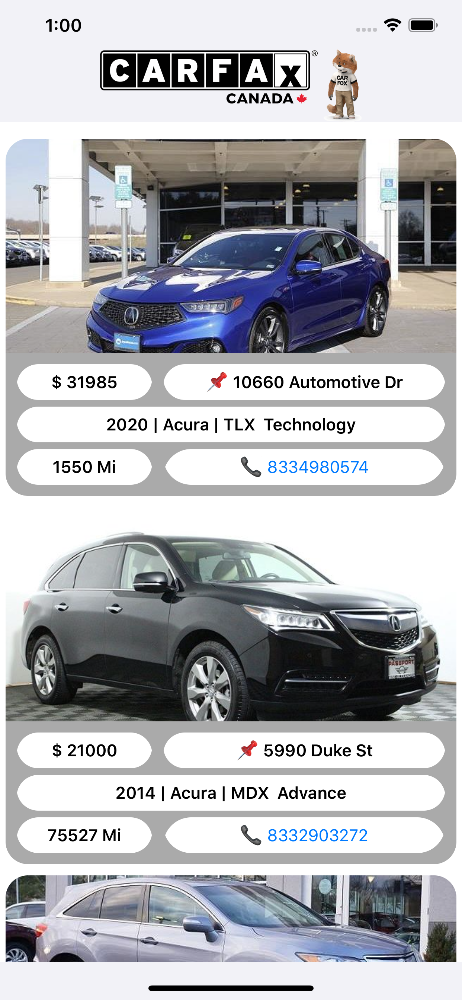

# CarFaxTest

Simple UI Designing displaying Carlist fetching JSON data from Get Webservice

Parsing it using Nsurl session and parsing it into Model Objects

Call functionality on click of phone number

Displying details such as:

• Vehicle photo

• Year, make, model, trim 

• Price

• Mileage

• Location

• Call dealer button

• Tapping “Call dealer button” should initiate a phone call towards the dealer.

